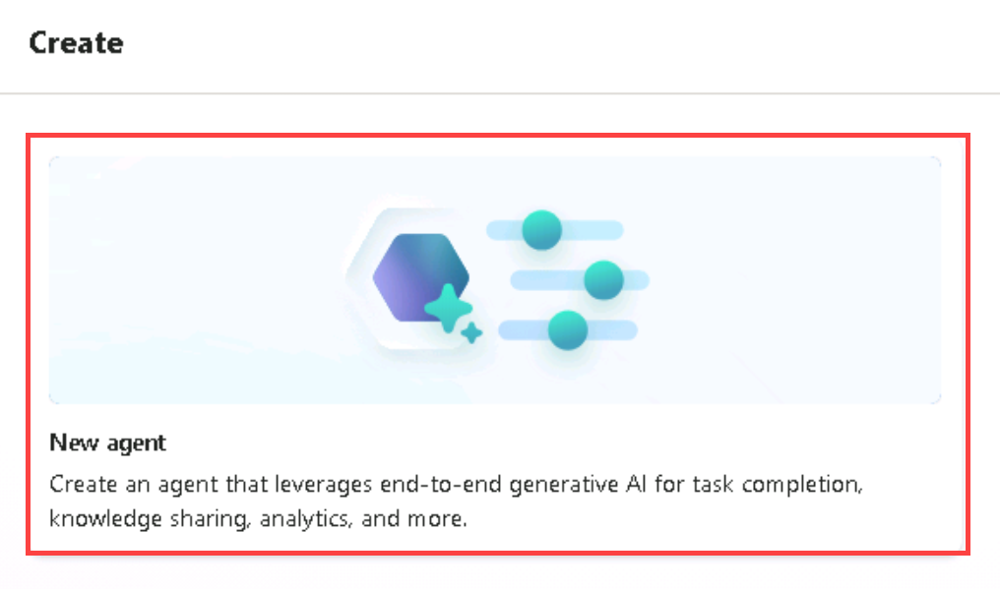
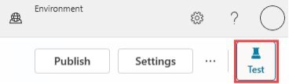

# 1 - Build Your First Agent

To start you're going to build your very first agent powered by Generative answers.

1. Open Microsoft Edge and navigate to

    +++https://copilotstudio.microsoft.com+++

1. Log in with 

    **Username:** +++@lab.CloudCredential(CSBatch1).UserPrincipalName+++

    **Password:** +++@lab.CloudCredential(CSBatch1).Password+++

    **Temporary Access Password:** +++@lab.Variable(TAP)+++

<!-- 3. If you see a message about needing to setup additional security like is shown below, select **Ask later**

     -->

1. If you see a welcome screen like is shown below, select the country/region that you’re in from the dropdown and select Get Started

    

1. If you see a welcome message as shown in the screenshot below, select Skip.

    

1. In the left nav click **+ Create** button to start creating a new agent

    

1. Click **New agent**

    

1. While we could use natural language to setup the agent for this exercise, we will skip directly to the configuration Click the Skip to configure button

    

1. Give your agent a unique name by including your first and last name, for example "Jane Does Agent" and then click the **+ Add knowledge**

    

1. In the Add available knowledge sources dialog click the **Public websites** button

    

1. In the Add public websites dialog enter +++www.microsoft.com+++ then click the **Add** button

1. With the new knowledge source added click the **Add** button in the bottom right of the dialog to include this in your new agent

    

1. With the dialog closed confirm the name and the knowledge source of your new agent are correct then in the top right click the **Create** button

    

1. In the agent test window enter +++What is Microsoft Copilot Studio?+++ and press enter

    > [!note] If you don't see the test your agent pane you can open this by clicking on Test button in the top right corner of the screen to open the test pane

    

Congratulations! you just built your first agent powered by generative answers.
