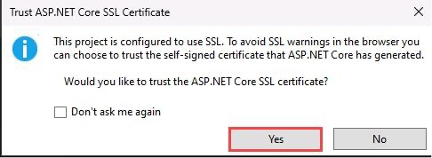
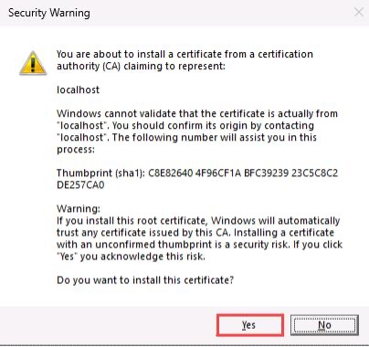
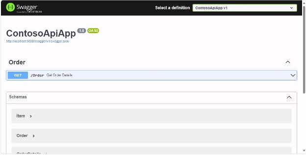
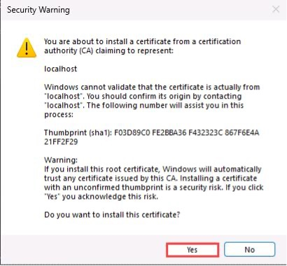

# @lab.Title


In this lab you’ll work with Microsoft Copilot Studio to build your first agent using Generative answers, you’ll then publish this agent to Microsoft Teams.

In the second half of this workshop, you'll extend your agent with a custom connector that you’ll build in Visual Studio, publish this as custom connector and then add this as an action to your agent.

The green text with the +++icon+++ can be clicked on and will be typed automatically into the VM, For example, please click in the password text box and then click the password: +++@lab.VirtualMachine(WRK530).Password+++

> [!note] To ensure text is entered accurately avoid interacting or clicking in the VM until the text has finished being typed

===

# 1 - Build Your First Agent

To start you're going to build your very first agent powered by Generative answers.

1. Open Microsoft Edge and navigate to

    +++https://copilotstudio.microsoft.com+++

2. Log in with 
<br>
    **Username:** +++@lab.CloudCredential(CSBatch1).UserPrincipalName+++


    **Password:** +++@lab.CloudCredential(CSBatch1).Password+++

    **Temporary Access Password:** +++@lab.Variable(TAP)+++

<!-- 3. If you see a message about needing to setup additional security like is shown below, select **Ask later**

     -->

3. If you see a welcome screen like is shown below, select the country/region that you’re in from the dropdown and select Get Started
<br>
    
4. If you see a welcome message as shown in the screenshot below, select Skip.
<br>
    
6. In the left nav click **+ Create** button to start creating a new agent
<br>
    
7. Click **New agent**
<br>
    
8. While we could use natural language to setup the agent for this exercise, we will skip directly to the configuration Click the Skip to configure button
<br>
    
9. Give your agent a unique name by including your first and last name, for example "Jane Does Agent" and then click the **+ Add knowledge**
<br>
        

10. In the Add available knowledge sources dialog click the **Public websites** button
<br>
    
11. In the Add public websites dialog enter +++www.microsoft.com+++ then click the **Add** button
<br>
12. With the new knowledge source added click the **Add** button in the bottom right of the dialog to include this in your new agent
<br>
        

13. With the dialog closed confirm the name and the knowledge source of your new agent are correct then in the top right click the **Create** button
<br>
    
14. In the agent test window enter +++What is Microsoft Copilot Studio?+++ and press enter

    > [!note] If you don't see the test your agent pane you can open this by clicking on Test button in the top right corner of the screen to open the test pane

    

Congratulations! you just built your first agent powered by generative answers.

===

# 2 - Publishing Your Agent

Now that you have confirmed your agent is working as expected let’s publish the agent. This allows you to then use your agent in other channels like embedding on your public website or using inside of Microsoft Teams


1. Click the **Publish** button in the top right-hand corner
<br>
    

1. Click the **Publish** button to publish your agent
<br>
    
<br>
    The following dialog will be displayed you can close this and your agent will finish publishing in the background
<br>
    
1. Now that it’s published, we need to make this available to use within Microsoft Teams. Select the **Channels** tab in the top menu
<br>
   
1. Under the list of channels, select **Microsoft Teams**

<br>
1. In the panel that opens on the right-hand side, select **Turn on Teams**
<br>
    
1. After Teams is turned on, you’ll get a message letting you know the channel was added. Select **Open agent** to add your new agent to Teams
<br>
   .
1. Choose **Use the web app instead**
<br>
    
1. You’ll see a preview of your agent. Select **Add**
<br>
   
24. Your agent is now added and accessible in Microsoft Teams. Test your agent by asking +++What are the specs for the latest Surface laptop?+++ in the prompt input and press Enter
<br>

Congratulations! You’ve now built and published an agent to Microsoft Teams!

===

# 3 - Extending Agent With Custom Connectors

In the last portion of the workshop, we showed you how to build a agent that uses Generative Answers as a source of information.

Now you'll step through how to build a custom connector that can be used as a plugin for your agents. Plugins allows agents to work with other systems, expanding your agents capabilities beyond answering questions.

In this example we will work with a custom API that can look up order details and then extend that scenario by adding a method to update the delivery address of a returned order.

1. In your Windows Task bar at the bottom of your VM, select the Visual Studio icon to launch Visual Studio.

1. In the **Open Recent** section on the left hand side, select the **ContosoApiApp file** which is located on the D drive at +++**D:\LabFiles\ContosoApiApp\ContosoApiApp**+++ 

** If you don't see this in the Open recent section, select "Open a project or solution" on the right and browse to the file path mentioned above and select the ContosoApiApp.sln file.
1. There might be a sign in to Visual Studio pop up, feel free to click **Close** in that screen.
2. This is the solution we will be building on to create a custom connector for our agent. Before continuing press **Ctrl+ Shift + B** to build the solution
<br>
    
3. While our app is technically set to run in HTTPS we are going to test it locally first Click the arrow next to **https** in the tool bar and select **http**

    > [!note] We will switch this back before publishing this to Microsoft Copilot Studio

    
4. Click the **Run** button to run your application
<br>
    
5. Click **Yes** on the **Trust ASP.NET Core SSL Certificate** dialog
<br>
    
6. Click **Yes** on the security warning dialog to install the certificate
<br>
    
5. Once the application is running it will appear in a new browser window showing the details about the objects and methods you can test.
<br>
    
6. Click the **Get** method and then click the **Try it out** button to test the get method
<br>
    
7. Enter an order number (any number will work) then click the **Execute** button
<br>
    
8. Scroll down to see the response returned from the **GetOrderDetails** method
<br>
    
9. Close the browser window to stop the App running

===

# 4 - Add a New Method To The Connector

Right now our API is setup with a method to get order details. Before we publish this as a connector, lets add one more method that can we can use to update the delivery address for an order. This will help us demonstrate how plugin actions in Copilot Studio can be used both to return information and submit information back to our API.

1. Add the following code in the **OrderControl.cs** file after the comment that says **Start Exercise Space**
<br>
    
<br>
    **Code:**

    ```
    [SwaggerOperation(OperationId="UpdateDeliveryAddress",
    Summary="Update delivery address",
    Description= "Update the delivery address for the order number provided then return the updated delivery details" )]
    //This is the definition for the HttpPost controller path 
    [HttpPost(Name = "/UpdateDeliveryAddress/{orderNumber}/{street}/{city}/{state}/{zipcode}")]
    
    //Crate a new public method that will return an order
    public Order UpdateDeliveryAddress(
    [SwaggerParameter("The Order number to be updated", Required= true)] string orderNumber,
    [SwaggerParameter("The updated Street Address", Required=true)] string street,
    [SwaggerParameter("The updated City name",Required= true)] string city,
    [SwaggerParameter("The updated State", Required=true)] string state,
    [SwaggerParameter("The udpated Zip Code", Required=true)] string zipcode
    )
    {
    Order orderToUpdate = GetOrderDetails(orderNumber);
    orderToUpdate.OrderDetails.ShippingAddress.Street = street;
    orderToUpdate.OrderDetails.ShippingAddress.City = city;
    orderToUpdate.OrderDetails.ShippingAddress.State = state;
    orderToUpdate.OrderDetails.ShippingAddress.ZipCode = zipcode;
    return orderToUpdate;
    }
    ```
 1. Confirm that the final code matches the screenshot below
<br>
    
8. Now let's test our new method before publishing the connector to make sure it works. Run your application locally again by clicking the **run** button
<br>
    
9. There will be a new Post method available in the ContosoApiApp
<br>
    
10. Click the new **Post** method and click **Try it out**
<br>
    
11. Enter the required details and click **Execute** to test
<br>
    
12. Scroll down to see the response and confirm the method is responding as expected
<br>
    
13. Close the browser window to stop the application

===

# 5 - Adding Connector To Microsoft Copilot Studio

With the connector built and the new post method added it's time to add this to Microsoft Copilot Studio so it can be used by the Generative Actions engine.

1. Before publishing the connector, we need to change the run mode from http back to https, click the arrow next to **http** and select **https**
<br>
    
1. In the solution explorer on the right side, **Right click>Connected Services>Add>Microsoft Power Platform**
<br>
    
1. In the top right of the **Connect to Microsoft Power Platform** dialog click **Sign in>Work, School or personal account** then use your tenant credentials to login to connect to the Power Platform.

    **Username:** +++@lab.CloudCredential(CSBatch1).UserPrincipalName+++


    **Password:** +++@lab.CloudCredential(CSBatch1).Password+++
        
    **Temporary Access Password:** +++@lab.Variable(TAP)+++

    
1. Check to make sure the **AI Roadshow (default)** environment is selected and that the **Common Data Services Default Solution** is selected then click the **Plus(+)** button to create a new custom connector
<br>
    
1. Accept the **Power Platform environment**. Update the **Custom connector name** to **Your First and Last Name Plus the word Connector**, for example, Jane Doe Connector. Then click **Create**. It's very important to remember this name as you'll need to reference this in later steps!


<br>

1. Next, you're going to create a Dev Tunnel so you can test your Connector. Click the **Plus (+)** button to create a public dev tunnel which will allow you to debug the connector when it's called from our agent
<br>

1. In the **Name** field, put **Your First and Last Name plus the world DevTunnel** for your Dev tunnel name then click the **Ok** button
<br>
    
1. Click **Next** to see a summary of the changes to be made
<br>
    
1. Click Finish to create the connector
<br>
    
1. Wait for the connector to be created then click **Close**
<br>
    

===

# 6 - Adding the Contoso Plugin to your Agent

1. Reopen the **Microsoft Edge** window from the start of the lab and click on the Copilot Studio tab
1. Click on the **Settings** button on the right of the top nav bar
<br>
    
1. Click on **Generative AI** in the left navigation
<br>
    
1. Confirm that the **Generative** option is selected then click **Save**
<br>
    
1. Click on **Close (x)** button to close out of settings and get back to your agent
<br>

1. Click on the **Actions** option in the top nav
<br>
    
1. Click the **+ Add an action** button to add a new action
<br>
    
1. Enter **the name of your connector from the Visual Studio Connected Service step (your first name last name connector)** in the search field and hit **Enter**
<br>
    
1. You may have to scroll down in the list of connectors to find your results. Once you do, you will see 2 actions returned from your connector. Each of these actions represents one of the methods in the connector that you just published from Visual Studio. 


1. Click **Get Order Details** to begin adding this action to your agent
<br>

1. Once the connector has loaded, in the End user authentication dropdown, select **Copilot author authentication** then click **Next**
<br>
    
1. On the Inputs and Outputs screen, click **Next** again.

1. Click **Finish** to complete adding the Get Order Details plugin action.
<br>
    
1. On the next screen, select **Add Action** to add the other action from our connector.

1. Enter **the name of your connector from the Visual Studio Connected Service step (your first name last name connector)** in the search field and hit **Enter**
<br>
    
1. You may have to scroll down in the list of connectors to find your results again. Click **Update Delivery Address** to begin adding this action to your agent
<br>

1. Once the connector has loaded, in the End user authentication dropdown, select **Copilot author authentication** then click **Next**
<br>
    
1. On the Inputs and Outputs screen, click **Next** again.
<br>
   
1. Click **Finish** to complete adding the plugin to the agent
<br>

1. Confirm that you see both the **Get items** and **Update delivery** actions in the list of items on the Actions screen

1. Return to Visual Studio and click the **Run** button next to the HTTPS flag to run your application in HTTPS
<br>
    
1. Click **Yes** on the **Microsoft Visual Studio** dialog to trust the IIS Express SSL certificate.
<br>
    
1. Click **Yes** on the final security warning dialog to install the IIS cert
<br>
    
1. Once the application is running a new browser window will open with a warning that you are about to connect to a developer tunnel click **Continue** to open your running application in Microsoft edge
<br>
    
1. With your application running return to Microsoft Copilot Studio in the **Test Copilot** pane click the Map button on the right to open the conversation map console
<br>
    
1. Now you can test your Copilot's new capabilities and see in real time how it is making calls to the plugins you just added. Enter +++What's my order details?+++ and click **send**
<br>
    
1. An **Activity Map** pane should pop up. This is where you can see how your agent is pulling together the actions needed to complete your request. However, as you have not provided an order number to make the call to the service it has formulated a response to ask you for the missing details
<br>
    
1. Enter an order number and click **send**
<br>
    
<br>
    You'll see the order number is passed to the actions and the results are returned to your agent
<br>
        

1. Click the reset button to start a new test session
<br>
    
1. Enter +++Update my delivery address for order 123456 to 1 Microsoft Way, Redmond 98052 WA+++ and click send
<br>
    
1. This time Copilot Studio will find the right action and it will be smart enough to fill all the address details in the right inputs as shown below


Congratulations! That's it! You have successfully created a new agent and extended that using a custom connector! 

Nothing will be graded so feel free to submit and close out of the VM. If you finished the workshop you get an A+!