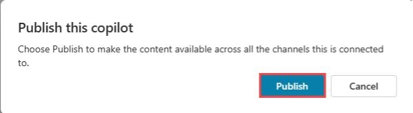
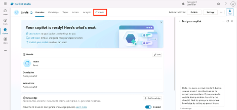
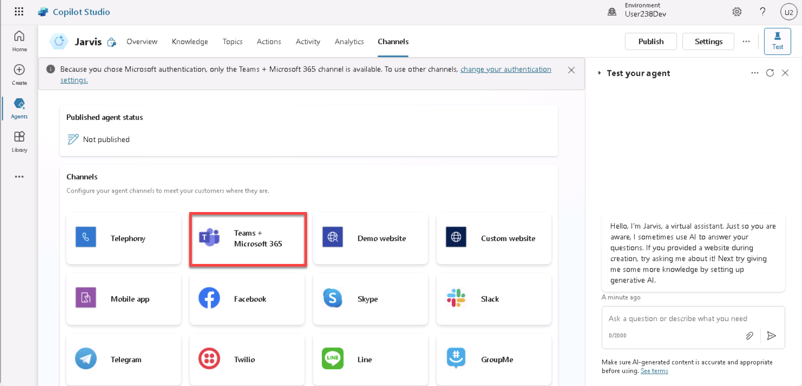
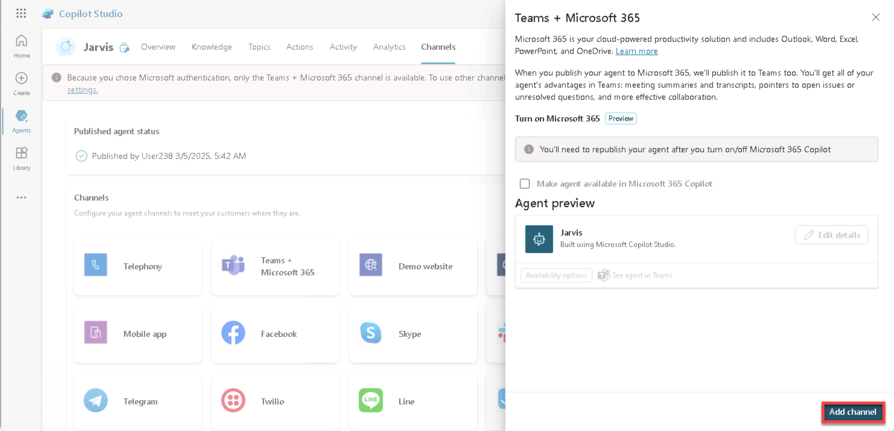
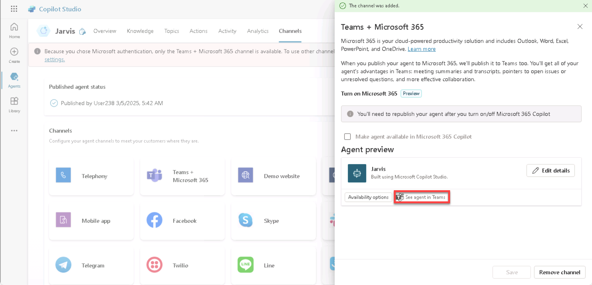
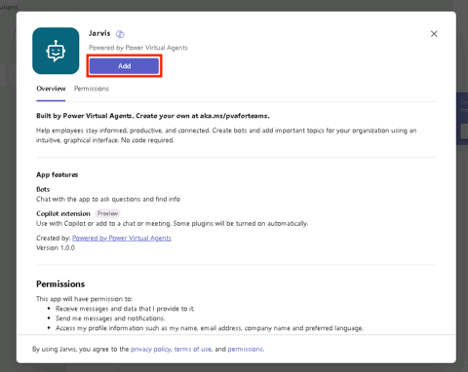
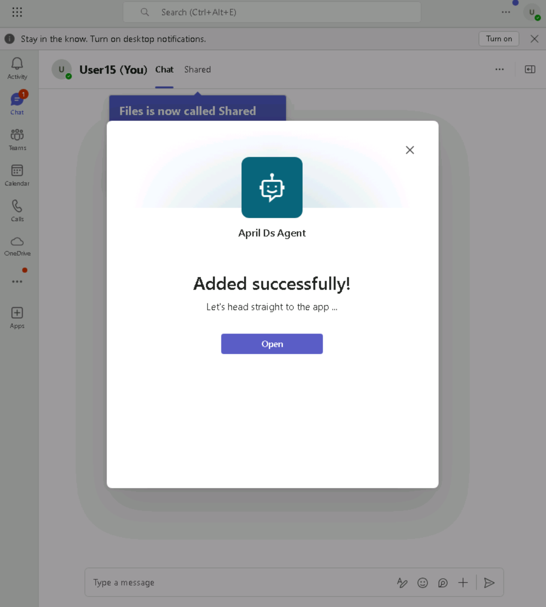

# 2 - Publishing Your Agent

Now that you have confirmed your agent is working as expected, let’s publish it. This allows you to use your agent in other channels like embedding on your public website or using inside of Microsoft Teams

1. Click the **Publish** button in the top right-hand corner

    

1. Click the **Publish** button to publish your agent

    

    > [!note]The following dialog might be displayed. You can close this and your agent will finish publishing in the background

    

1. Now that it’s published, we need to make this available to use within Microsoft Teams. Select the **Channels** tab in the top menu

    

1. Under the list of channels, select **Microsoft Teams + Microsoft 365**

    

1. In the panel that opens on the right-hand side, select **Add channel**

    

1. After the channel is added, you’ll get a message letting you know the channel was added. Select **See agent in Teams** to see your new agent in Teams

    .

1. Choose **Use the web app instead**

    

1. You’ll see a preview of your agent. Select **Add**

    

1. You’ll see a message that your agent was added successfully. Select **Open** to open your agent in Teams.

    

1. Test your agent by asking +++What are the specs for the latest Surface laptop?+++ in the prompt input and press Enter

    

Congratulations! You’ve now built and published an agent to Microsoft Teams!
