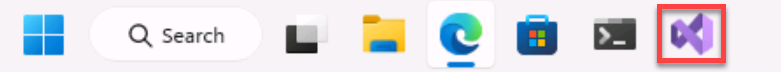
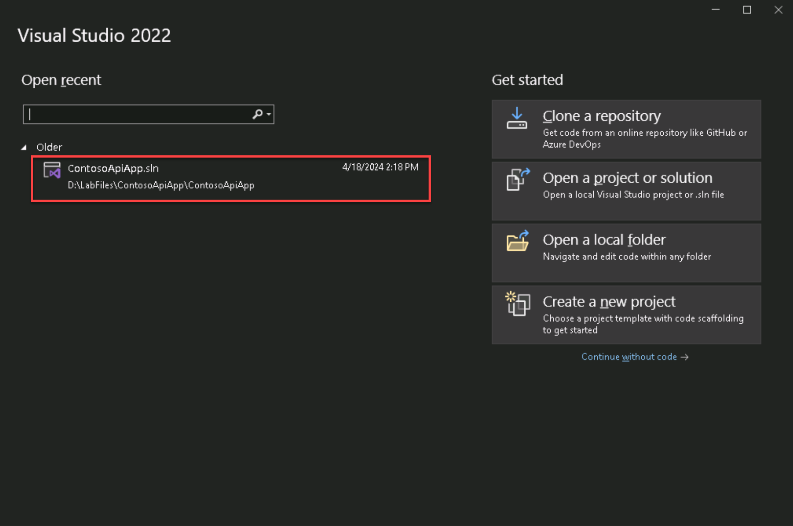

# 3 - Extending Agent With Custom Connectors

In the last portion of the workshop, we showed you how to build a agent that uses Generative Answers as a source of information.

Now you'll step through how to build a custom connector that can be used as a plugin for your agents. Plugins allows agents to work with other systems, expanding your agents capabilities beyond answering questions.

In this example we will work with a custom API that can look up order details and then extend that scenario by adding a method to update the delivery address of a returned order.

1. In your Windows Task bar at the bottom of your VM, select the Visual Studio icon to launch Visual Studio.

    

1. In the **Open Recent** section on the left hand side, select the **ContosoApiApp file** which is located on the D drive at +++**D:\LabFiles\ContosoApiApp\ContosoApiApp**+++ 

    

    ** If you don't see this in the Open recent section, select "Open a project or solution" on the right and browse to the file path mentioned above and select the ContosoApiApp.sln file.

1. There might be a sign in to Visual Studio pop up, feel free to click **Close** in that screen.

1. This is the solution we will be building on to create a custom connector for our agent. Before continuing press **Ctrl+ Shift + B** to build the solution

    

1. While our app is technically set to run in HTTPS we are going to test it locally first Click the arrow next to **https** in the tool bar and select **http**

    > [!note] We will switch this back before publishing this to Microsoft Copilot Studio

    

1. Click the **Run** button to run your application

    

1. Click **Yes** on the **Trust ASP.NET Core SSL Certificate** dialog

    

1. Click **Yes** on the security warning dialog to install the certificate

    

1. Once the application is running it will appear in a new browser window showing the details about the objects and methods you can test.

    

1. Click the **Get** method and then click the **Try it out** button to test the get method

    

1. Enter an order number (any number will work) then click the **Execute** button

    

1. Scroll down to see the response returned from the **GetOrderDetails** method

    

1. Close the browser window to stop the App running
