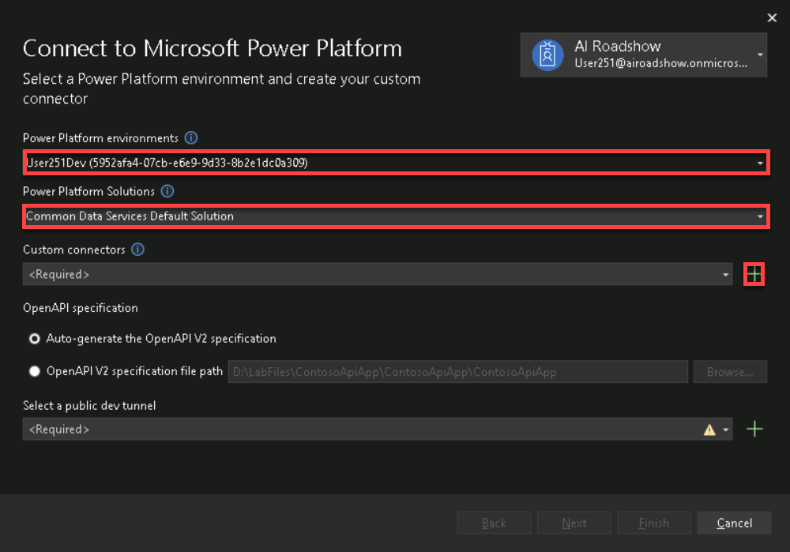
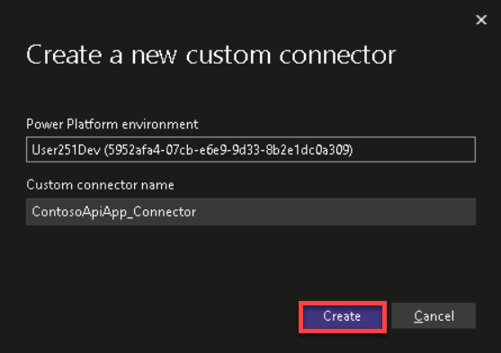
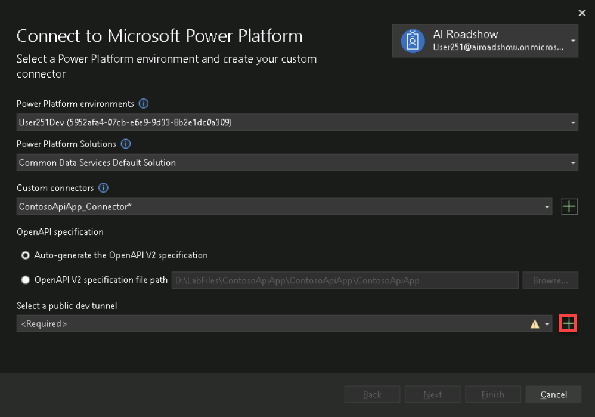
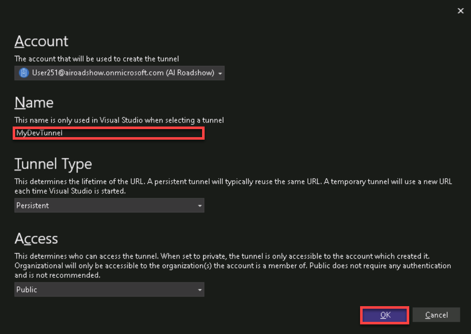
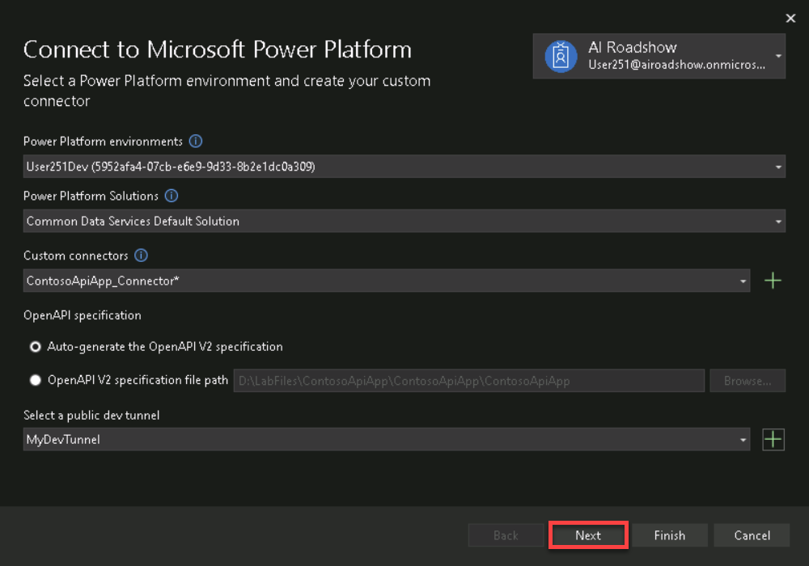
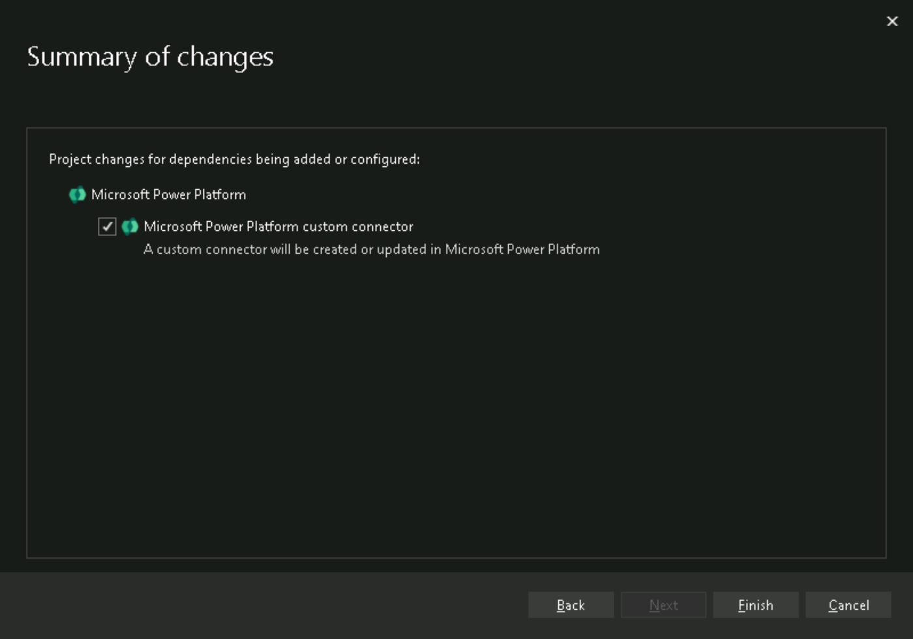
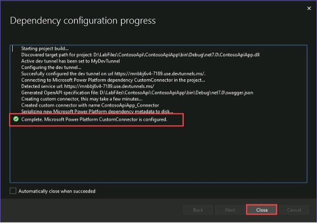

# 5 - Adding Connector To Microsoft Copilot Studio

With the connector built and the new post method added it's time to add this to Microsoft Copilot Studio so it can be used by the Generative Actions engine.

1. Before publishing the connector, we need to change the run mode from http back to https, click the arrow next to **http** and select **https**

    

1. In the solution explorer on the right side, **Right click>Connected Services>Add>Microsoft Power Platform**

    

1. In the top right of the **Connect to Microsoft Power Platform** dialog click **Sign in>Work, School or personal account** then use your tenant credentials to login to connect to the Power Platform.

    **Username:** +++@lab.CloudCredential(CSBatch1).UserPrincipalName+++

    **Password:** +++@lab.CloudCredential(CSBatch1).Password+++
        
    **Temporary Access Password:** +++@lab.Variable(TAP)+++

    

1. Check to make sure the your developer environment (**User251Dev** if your user is User251) is selected and that the **Common Data Services Default Solution** is selected then click the **Plus(+)** button to create a new custom connector

    

1. Leave the custom connector name the same, and click **Create**.

    

1. Next, you're going to create a Dev Tunnel so you can test your Connector. Click the **Plus (+)** button to create a public dev tunnel which will allow you to debug the connector when it's called from our agent

    

1. In the **Name** field, put **MyDevTunnel** for your Dev tunnel name then click the **Ok** button

    

1. Click **Next** to see a summary of the changes to be made

    

1. Click Finish to create the connector

    

1. Wait for the connector to be created then click **Close**

    
